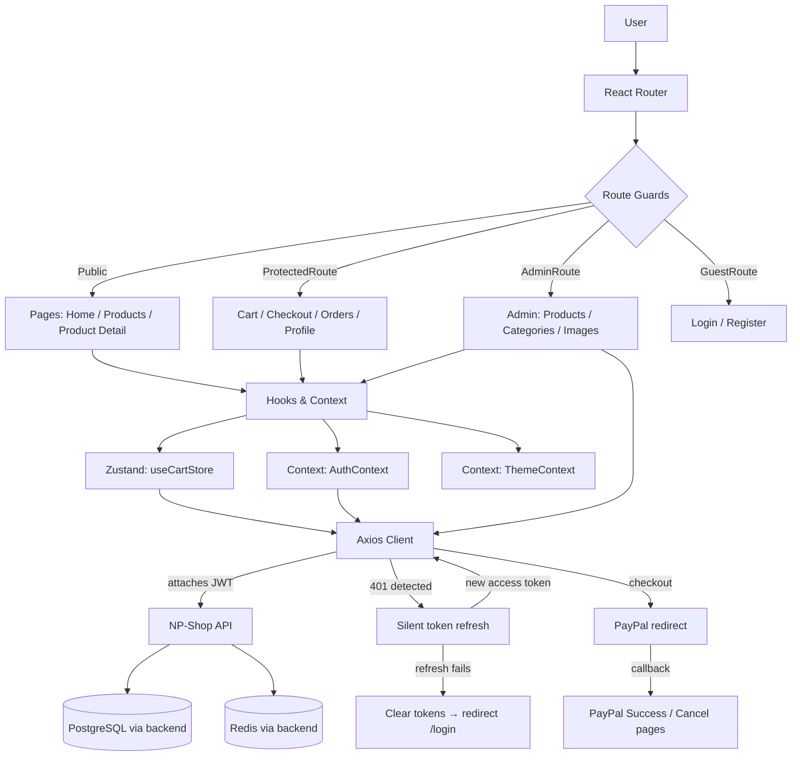

<div align="center">

# ⚙︎ NP-Shop Web

**A React + Vite storefront for the NP-Shop e-commerce API — product browsing, cart, checkout with PayPal, order history, and an admin panel.**

[](https://react.dev/)
[](https://vitejs.dev/)
[](https://reactrouter.com/)
[](https://zustand-demo.pmnd.rs/)
[](https://axios-http.com/)
[](https://tailwindcss.com/)
[](https://www.framer.com/motion/)
[](https://developer.paypal.com/)
[](https://vercel.com/)

</div>

---

## ✎ Overview

**NP-Shop Web** is the React frontend for the [NP-Shop API](https://github.com/julhariemaddin/np-shop) — a Spring Boot e-commerce backend. It's built with **Vite** for fast dev/build, **React Router** for client-side routing, **Zustand** for cart state, and a centralized **Axios** client that handles JWT attachment and silent access-token refresh on `401`s.

---

## ▶︎ Quick Start

```bash
git clone https://github.com/julhariemaddin/np-shop-web.git
cd np-shop-web

npm install

# copy the example env and point it at your backend
cp .example.env .env

npm run dev
```

The app runs at `http://localhost:5173` by default (Vite's default port).

---

## ⚒︎ Tech Stack

| Layer | Technology |
|---|---|
| **Framework** |  |
| **Build Tool** |  |
| **Routing** |  |
| **State Management** |  (cart) + React Context (auth, theme) |
| **HTTP Client** |  |
| **Styling** |   + CSS Modules |
| **Animation** |  |
| **Notifications** |  |
| **Payments** |  (redirect-based checkout) |
| **Deployment** |  (SPA rewrites configured) |

---

## ✦ Features

- ⚿ **JWT authentication** — login/register, with access-token attach + silent refresh-on-401 handled centrally in the Axios client
- ▣ **Product catalog** — listing, search, product detail, reviews
- ⛁ **Cart** — server-synced cart (Zustand store mirrors the backend's Redis-backed cart)
- ⌁ **PayPal checkout** — redirect-based payment flow with dedicated success/cancel result pages
- ☐ **Order history** — view past and pending orders
- ✎ **Profile management** — update profile info and password
- ⚙︎ **Admin panel** — manage products, categories, and product images (role-gated)
- ◐ **Dark mode** — theme respects system preference, with manual override persisted in `localStorage`
- ⌂ **Route guards** — `ProtectedRoute`, `AdminRoute`, and `GuestRoute` wrappers control access per route

---

## ⌂ Architecture



**How a request flows:**
1. **React Router** matches the URL and runs it through the relevant **route guard** (`ProtectedRoute`, `AdminRoute`, or `GuestRoute`), which reads auth state from `AuthContext`.
2. Pages call into **hooks/context** — the Zustand `useCartStore` for cart operations, `AuthContext` for login/register/logout, `ThemeContext` for dark mode.
3. All network calls go through the shared **Axios client** (`src/api/client.js`), which automatically attaches the JWT and, on a `401`, transparently refreshes the access token (queuing any requests that arrive mid-refresh) before retrying — or clears tokens and redirects to `/login` if the refresh itself fails.
4. **PayPal checkout** is redirect-based: the app sends the user to PayPal, then PayPal redirects back to `/paypal/success` or `/paypal/cancel`, which call the backend to capture/cancel the payment and show the result.

---

## ⌁ API Integration

The app talks to five logical groups of backend endpoints, each with its own Axios instance (`src/api/client.js`) so base URLs can differ per group (useful when running behind ngrok or split across services):

| Axios instance | Env variable | Talks to |
|---|---|---|
| `api` | `VITE_API_BASE_URL` | Products, categories, cart, orders, images, reviews |
| `authApi` | `VITE_AUTH_BASE_URL` | Register / sign-in |
| `userApi` | `VITE_USER_BASE_URL` | Profile + password updates |
| `paypalApi` | `VITE_PAYPAL_BASE_URL` | PayPal payment creation/capture/cancel |
| `serverApi` | `VITE_SERVER_BASE_URL` | Health check |

Refresh requests go directly to `VITE_REFRESH_URL` (outside the instance pool, since it must not carry a stale token).

All requests for `api`, `userApi`, `paypalApi`, and `serverApi` get the access token attached automatically and are retried once after a silent refresh if the backend returns `401`.

---

## ⚿ Configuration

### Environment Variables

| Variable | Description |
|---|---|
| `VITE_API_BASE_URL` | Base URL for products/categories/cart/orders/images/reviews (e.g. `http://localhost:8080/api/v1`) |
| `VITE_SERVER_BASE_URL` | Health check endpoint base (e.g. `http://localhost:8080/api/v1/server`) |
| `VITE_AUTH_BASE_URL` | Auth endpoint base (e.g. `http://localhost:8080/api/auth`) |
| `VITE_REFRESH_URL` | Full refresh-token endpoint URL (e.g. `http://localhost:8080/request`) |
| `VITE_USER_BASE_URL` | Profile endpoint base (e.g. `http://localhost:8080/api/users/me`) |
| `VITE_PAYPAL_BASE_URL` | PayPal endpoint base (e.g. `http://localhost:8080/api/paypal`) |

`.env.example`:

```env
# Local development — points at a backend running on localhost
VITE_API_BASE_URL=http://localhost:8080/api/v1
VITE_SERVER_BASE_URL=http://localhost:8080/api/v1/server
VITE_AUTH_BASE_URL=http://localhost:8080/api/auth
VITE_REFRESH_URL=http://localhost:8080/request
VITE_USER_BASE_URL=http://localhost:8080/api/users/me
VITE_PAYPAL_BASE_URL=http://localhost:8080/api/paypal
```

> All `VITE_*` variables are bundled into the client at build time (per Vite convention) — never put real secrets in them. They only ever need to be backend **URLs**.

---

## ⌂ Routes

| Path | Page | Access |
|---|---|---|
| `/` | Home | Public |
| `/products` | Product listing | Public |
| `/products/:id` | Product detail | Public |
| `/login` | Login | Guest only |
| `/register` | Register | Guest only |
| `/cart` | Cart | Authenticated |
| `/checkout` | Checkout | Authenticated |
| `/orders` | Order history | Authenticated |
| `/profile` | Profile settings | Authenticated |
| `/paypal/success` | PayPal payment success callback | Public |
| `/paypal/cancel` | PayPal payment cancel callback | Public |
| `/admin` | Admin dashboard | Admin only |
| `/admin/products` | Manage products | Admin only |
| `/admin/products/new` | Create product | Admin only |
| `/admin/products/:id/edit` | Edit product | Admin only |
| `/admin/products/:id/images` | Manage product images | Admin only |
| `/admin/categories` | Manage categories | Admin only |
| `*` | 404 Not Found | Public |

---

## ⛁ Deployment

Deployed on **Vercel**. `vercel.json` rewrites all paths to `index.html` so React Router's client-side routes resolve correctly on full page loads/refreshes:

```json
{
  "rewrites": [
    { "source": "/(.*)", "destination": "/index.html" }
  ]
}
```

To deploy:

```bash
npm run build
# then push to the Git remote connected to your Vercel project,
# or run `vercel --prod` if using the Vercel CLI
```

Set the same `VITE_*` environment variables in your Vercel project settings (Production environment) so the built app points at your live backend instead of `localhost`.

---

## ⌂ Project Structure

```
np-shop-v7/
├── src/
│   ├── api/              # Axios instances, interceptors, endpoint definitions
│   ├── components/
│   │   ├── auth/          # Route guards (Protected / Admin / Guest)
│   │   ├── common/        # Button, Input
│   │   ├── layout/        # Header, Layout shell
│   │   └── product/       # ProductCard
│   ├── context/           # AuthContext, ThemeContext
│   ├── hooks/             # useCart (Zustand store)
│   ├── pages/
│   │   ├── admin/          # Admin dashboard, product/category/image management
│   │   ├── auth/            # Login, Register
│   │   └── user/            # Profile
│   ├── styles/            # Global CSS
│   ├── App.jsx            # Route definitions
│   └── main.jsx           # Entry point
├── vite.config.js
└── vercel.json            # SPA rewrite rules
```

---

## ✎ Author

**Julharie M. Maddin**
[GitHub @julhariemaddin](https://github.com/julhariemaddin)

---

<div align="center">

Built with ⚛︎ React & ⚡︎ Vite

</div>
